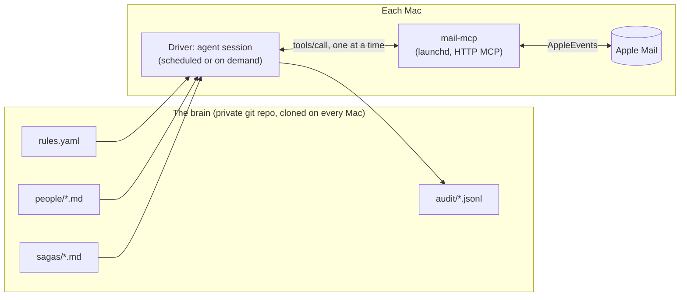

# Smart Mail Assistant: design notes

**Status:** draft, 2 September 2026. **Scope:** this fork only; not proposed upstream.

`mail-mcp` gives an agent hands inside Apple Mail: it can read, search, draft, and (with `move_messages` / `delete_messages`) file and tidy. This document describes what is built *on top of* those hands: an assistant that keeps an inbox tidy, remembers the people who matter, and prepares replies, across more than one Mac, without ever sending anything on its own.

It is deliberately written in the abstract. Everything personal (who the people are, which senders are junk, the rules themselves) lives in a **separate private repository** described in [The brain](#the-brain-a-private-repository-of-files). Nothing in this public fork should ever contain a real name, address, or sender.

<!-- START doctoc generated TOC please keep comment here to allow auto update -->

- [The problem](#the-problem)
- [Principles and hard rails](#principles-and-hard-rails)
- [Architecture](#architecture)
  - [The brain: a private repository of files](#the-brain-a-private-repository-of-files)
    - [`rules.yaml`](#rulesyaml)
    - [`people/<slug>.md`: per-person memory](#peopleslugmd-per-person-memory)
- [Open threads](#open-threads)
- [Recent summary (rolling, ~10 lines)](#recent-summary-rolling-10-lines)
- [Provenance](#provenance)
    - [`sagas/<slug>.md`: per-situation status](#sagasslugmd-per-situation-status)
    - [`audit/<date>.jsonl`](#auditdatejsonl)
- [Workflows](#workflows)
  - [1. Tidy](#1-tidy)
  - [2. Morning catch-up](#2-morning-catch-up)
  - [3. Pre-drafts](#3-pre-drafts)
  - [4. Junk rescue](#4-junk-rescue)
  - [5. Waiting-on](#5-waiting-on)
  - [6. Commitments](#6-commitments)
  - [7. Thread stitching](#7-thread-stitching)
  - [8. Records filing and attachment harvesting](#8-records-filing-and-attachment-harvesting)
- [Tooling: what exists and what is needed](#tooling-what-exists-and-what-is-needed)
  - [Operational notes the assistant must respect](#operational-notes-the-assistant-must-respect)
- [Rollout: capturing preferences safely](#rollout-capturing-preferences-safely)
- [Privacy and safety](#privacy-and-safety)
- [Open questions](#open-questions)
- [Origin](#origin)

<!-- END doctoc generated TOC please keep comment here to allow auto update -->

## The problem

A large inbox (tens of thousands of messages, thousands of distinct senders) has three separate failure modes, and most "smart inbox" features address only the first:

1. **Noise.** Marketing, notifications and transactional mail bury the messages that need a human.
2. **Lost context.** A conversation with one person is spread across months and, for people who start a new thread every time rather than replying, across many subjects. Getting up to speed on "where are we with X" means re-reading everything.
3. **Dropped balls.** Things you promised, things you asked for and never got, and replies you sent that went unanswered all disappear below the fold.

The assistant is judged on all three, and on one more: **it must be safe to leave running.**

## Principles and hard rails

These are not preferences. They are checked before every action, and a rule that cannot satisfy them does not run.

| Rail | Meaning |
|---|---|
| **Never send** | The assistant drafts. A human sends. There is no tool path to `send`, and none will be added. |
| **Search, then act, never both** | Actions take explicit message IDs from a prior `find_messages`. A filter can never delete anything by itself. |
| **Dry run everything** | Every action rule runs in dry-run mode first, and reports what it *would* have done, until a human enables it. |
| **Trash, never delete** | `delete_messages` moves to the account's Trash. Emptying Trash is a human act. |
| **Allow-lists beat heuristics** | A sender on the people allow-list is never auto-filed or trashed, however much they send. Volume is not a signal of junk: the highest-volume sender in a family inbox is usually a family member. |
| **Records are kept, not binned** | Anything that is evidence of a transaction (itinerary, invoice, receipt, contract, correspondence from a lawyer, bank or insurer) is filed, never trashed. |
| **Flagged is untouchable** | A flagged message is excluded from every automatic action. |
| **Audit everything** | Every action, including dry runs, is appended to a log a human can read in a weekly digest. |
| **One Mail call at a time** | Mail.app serialises AppleEvents; concurrent calls exceed client timeouts and fail unpredictably. The driver serialises. |

## Architecture

Three parts, and only one of them holds state.



- **The brain is files.** Rules, per-person memory, per-situation status and the audit log are plain text in a private repository. Clone it on a second Mac and that Mac knows everything the first one knows. There is no database and no app state to migrate.
- **The hands are `mail-mcp`,** one instance per Mac, unchanged from this repository. The assistant needs nothing that is not a documented tool.
- **The driver is an agent session** (for example a scheduled Claude Code run) that loads the brain, calls the tools, and writes back to the brain. It holds no state between runs.

### The brain: a private repository of files

```
mail-brain/                     # private repo
├── rules.yaml                  # who matters, what to do per sender class, red lines
├── people/
│   ├── [parent].md             # one file per person who matters
│   └── [sibling].md
├── sagas/
│   └── [house-move].md         # one file per live situation
├── audit/
│   └── 2026-09-02.jsonl        # one line per action, including dry runs
└── digests/
    └── 2026-W36.md             # weekly summary of what happened
```

#### `rules.yaml`

The only file a human is expected to edit regularly. Everything is explicit; there are no implied defaults that act.

```yaml
version: 1

people:                         # the allow-list. Never auto-filed, never trashed.
  - name: "[Parent]"
    addresses: ["parent@example.com", "parent.old@example.net"]
    memory: people/parent.md
    thread_hopping: true        # starts new threads instead of replying; stitch by participant + time
  - name: "[Sibling]"
    addresses: ["sibling@example.org"]
    memory: people/sibling.md

domains_allow: ["employer.example", "family-domain.example"]

red_lines:                      # checked before every action
  never_trash_from: ["*@bank.example", "*@lawyer.example"]
  never_touch_flagged: true
  never_touch_with_attachments_from: people   # anything with an attachment from an allow-listed person
  never_draft_to: ["*@no-reply.example"]

classes:                        # sender classes. Each rule starts in dry_run: true.
  - name: wine-marketing
    match: { senders: ["news@wine-merchant.example", "*@cellar.example"] }
    action: keep_latest          # keep the newest N, trash the rest
    keep: 1
    dry_run: true
  - name: delivery-notifications
    match: { senders: ["noreply@courier.example"] }
    action: trash_after_days
    days: 14
    dry_run: true
  - name: travel-records
    match: { senders: ["*@airline.example"], subject_any: ["itinerary", "e-ticket", "booking"] }
    action: file                 # records are filed, never trashed
    to: ["Travel"]
    dry_run: true
  - name: invoices
    match: { subject_any: ["invoice", "receipt", "tax invoice"] }
    action: file
    to: ["Invoices"]
    save_attachments: "~/Documents/Invoices"   # needs save_attachment (roadmap)
    dry_run: true
  - name: dev-notifications
    match: { senders: ["notifications@forge.example"] }
    action: trash_after_days
    days: 7
    dry_run: true

brief:                          # what the morning catch-up considers important
  important_if_any:
    - from_people
    - reply_to_my_mail
    - contains_question
    - mentions_money_or_date
  examples_important: ["[Parent] asking about the contract", "client confirming a call time"]
  examples_not: ["newsletter with a question in the subject line"]
  waiting_on_after_days: 5      # my sent mail with no reply -> propose a nudge

junk:
  auto_trash_obvious: true      # only mail Mail.app itself already classed as junk AND not from people/domains_allow
  rescue_pass: daily            # look in Junk for anything from people/domains_allow or replying to my mail
```

Semantics worth being precise about:

- `keep_latest` trashes older messages **from that sender only**, and never anything unread.
- `trash_after_days` measures from `date_received`.
- `file` moves; it never trashes, even if the target already holds a duplicate.
- A message that matches a `people` entry or a `red_lines` rule is removed from consideration **before** classes are evaluated.
- A class with `dry_run: true` writes to the audit log with `"dry_run": true` and changes nothing.

#### `people/<slug>.md`: per-person memory

The purpose is to answer "where are we with this person" in one screen, not to store their mail. The file is regenerated from the mailbox when it drifts, so it can be aggressive about brevity; the mail remains the source of truth.

```markdown
# [Parent]

**Addresses:** parent@example.com (current), parent.old@example.net (until 2023)
**How they write:** starts a new thread for every reply; long; practical detail mixed with day-to-day news. Read the whole message, the ask is often in the last paragraph.
**Standing facts:** [things that do not change: relationships, location, recurring constraints]

## Open threads
- **[Boiler replacement]** see sagas/boiler.md. Waiting on: second quote (promised "next week" on 3 Mar). Last from them: 5 Mar, msg 100234.
- **[Birthday lunch]** venue undecided; they prefer somewhere with parking. Last mention: 1 Mar, msg 100198.

## Recent summary (rolling, ~10 lines)
- 12 Feb: first quote for the boiler arrived; they think it is high.
- 20 Feb: asked whether we could look over the quote; we said yes.
- 3 Mar: second plumber visited; quote promised for the following week.
- 5 Mar: birthday lunch raised again; two venues suggested.

## Provenance
Every line above cites a message ID where it can. Regenerate with: find_messages sender=<addresses> dateAfter=<last regen>.
```

Rules for this file: it is bounded (target under 80 lines); anything older than the rolling window is dropped, not archived, because the mail still exists; every claim that matters carries a message ID so it can be checked; and it is **never** committed to a public repository.

#### `sagas/<slug>.md`: per-situation status

A situation is a decision or process with several people, numbers and open items over weeks: a house move, a contract negotiation, an insurance claim. The file is a living hand-over note: the decision, the numbers as they stand, what is confirmed, what is open, the key documents and the contacts. It is updated from mail as it arrives and is the first thing to read before replying to anyone involved.

#### `audit/<date>.jsonl`

One line per action, including dry runs, so the weekly digest can be generated and mistakes can be traced:

```json
{"ts":"2026-03-06T22:10:03Z","rule":"wine-marketing","action":"delete_messages","dry_run":true,"account":"Main","mailbox":["INBOX"],"ids":[100120,100118],"kept":[100231],"note":"keep_latest=1"}
```

## Workflows

Each workflow is a short, idempotent script the driver runs. They share the brain and the rails.

### 1. Tidy

Runs daily. For each `class` in `rules.yaml`: `find_messages` by sender (and subject where given) → remove anything matching `people` or `red_lines` → apply the class action with `dryRun` unless the class is enabled → append to the audit log. Bulk tools are capped at 500 IDs per call, so large backlogs are paged.

The first run against a real backlog is **always** a dry run, and its report is the first thing a human reviews (see [Rollout](#rollout-capturing-preferences-safely)).

### 2. Morning catch-up

Runs once a day, early. Reads everything received since the last run, drops anything a tidy rule handles, and ranks the rest by the `brief.important_if_any` signals. Output is a short digest: what needs you, what is waiting on others, what was auto-handled (with counts). It ends with a list of the drafts it prepared.

### 3. Pre-drafts

For each message the catch-up marks important **and** whose sender has a `people` entry: load the person file and any linked saga, read the thread (stitched if `thread_hopping`), and create a reply with `create_reply` in the person's register. The draft sits in the Drafts folder, subject-prefixed so it is identifiable (for example `[draft] Re: …`), and the digest lists it. It is never sent.

Voice comes from a separate tone-of-voice skill; per-person register notes live in the person file, not here.

### 4. Junk rescue

Runs daily. `find_messages` in the Junk mailbox for anything from `people`, `domains_allow`, or replying to a message the user sent (`In-Reply-To` against Sent). Candidates are moved back to INBOX with `move_messages` and listed in the digest. Obvious junk (already classed as junk by Mail.app **and** matching nothing above) is trashed only when `junk.auto_trash_obvious` is enabled.

### 5. Waiting-on

Weekly, or as part of the catch-up. For each message in Sent older than `brief.waiting_on_after_days` with no reply in the thread, propose a nudge draft. This is the workflow that catches "I asked the vendor a question on Tuesday and heard nothing."

### 6. Commitments

Weekly. Mine Sent mail for promises with dates ("I'll send X by Friday") and received mail for asks with dates, and list them with due dates in the digest. No action beyond listing; the value is the list.

### 7. Thread stitching

A library function used by the others, not a scheduled job. For a person with `thread_hopping: true`, "the conversation" is every message between the user and that person in a time window, regardless of subject, ordered by date. Pre-drafts and person-file regeneration read the stitched conversation, not a single thread.

### 8. Records filing and attachment harvesting

Part of Tidy. Classes with `action: file` move records into their folders; classes with `save_attachments` additionally save the attachment to disk. The second half needs a tool that does not exist yet (below).

## Tooling: what exists and what is needed

`mail-mcp` today (this fork) provides fifteen tools. The assistant uses them as follows.

| Need | Tool | Status |
|---|---|---|
| Enumerate accounts and folders | `list_accounts`, `list_mailboxes` | exists |
| Find by sender / subject / date / read / flagged | `find_messages` | exists; bulk property fetch handles tens of thousands of messages when calls are serialised |
| Read a message, headers, recipients, attachment names | `get_message_content` | exists |
| Draft a reply / a new message, replace, list, delete drafts | `create_reply`, `replace_reply`, `create_outgoing_message`, `replace_outgoing_message`, `list_outgoing_messages`, `list_drafts`, `delete_draft`, `delete_outgoing_message` | exists |
| File messages | `move_messages` | exists (this fork) |
| Trash messages | `delete_messages` | exists (this fork) |
| **Save an attachment to disk** | `save_attachment` | **needed.** `get_message_content` returns only name, size and downloaded state. Mail's scripting dictionary exposes saving an attachment to a path; same pattern as the bulk tools. Blocks records harvesting. |
| **Mark read / unread, flag / unflag** | `set_message_flags` | **needed.** Cheap property setters on fields the scripts already read. Lets the digest mark what it has surfaced. |
| **Sender census** | `count_messages` (group by sender) | **useful.** Today a census requires reading the on-disk `.emlx` store directly, which is fast but bypasses the server and is not portable. A grouped count over the same bulk property fetch would keep everything behind the API. |
| List-Unsubscribe extraction | header access in `get_message_content` | **useful.** `allHeaders` is already returned; the assistant can parse `List-Unsubscribe` from it today. A dedicated field would be tidier. |

### Operational notes the assistant must respect

- **Concurrency.** Never issue two Mail calls at once. The Go server has no timeout of its own (only a five-second paste wait for the accessibility path); a queued call dies on the *client's* timeout, and the failure looks like a slow mailbox when it is not. A mutex in the executor would make this a wait instead of a failure and is worth adding.
- **First-call flakiness.** A tool run from a fresh process occasionally fails once with an AppleEvent error such as "Account not found". Retry once before treating it as real.
- **Rebuilding the binary invalidates the Accessibility grant.** The drafting tools then fail with a permission error until the stale entry is removed in System Settings, the tool is re-run to trigger a new prompt, and the launchd service is restarted. See `docs/AUTOMATION_PERMISSIONS.md` and `docs/LAUNCHD_SERVICE_MANAGEMENT.md`.
- **Draft IDs churn.** Mail auto-saves an open compose window every few seconds and each save is a new draft ID; a drafts listing taken while a window is open is stale within seconds. Identify drafts by subject and recipients, not by ID, and expect leftover auto-saves after `replace_reply`.
- **JXA `log()` output** only reaches the service log at debug level. Run with debug logging when diagnosing a slow search.

## Rollout: capturing preferences safely

The rules engine needs decisions only the owner can make. Each is captured with the least possible effort and validated before it can act.

| Decision | Captured how |
|---|---|
| Who matters (`people`, `domains_allow`) | Seeded from **sent** mail (the people the owner actually writes to), then reviewed by ticking. |
| Keep / file / trash per sender class | Seeded from a sender census of the inbox; the owner edits one column of a table. |
| What "important" means | Six examples each way, plus the built-in signals. |
| Voice per person | Tone-of-voice skill plus short per-person register notes. |
| Retention | One number per class. |
| Red lines | A short "never" list. |
| Folder taxonomy | The owner marks live folders; the assistant proposes merges of dead ones. |

The sequence, which is the whole safety model:

1. **Seed.** Generate a proposed `rules.yaml` and the first draft of each person file from the data. Every class is `dry_run: true`.
2. **Tick.** The owner edits. Ten minutes, not an afternoon.
3. **Dry-run week.** Run every workflow daily in dry-run mode. Each day's digest says what *would* have happened.
4. **Enable per rule.** Flip `dry_run: false` one class at a time, lowest risk first (notifications before anything with a human sender).
5. **Weekly digest, forever.** Counts of what was handled, everything filed or trashed listed by sender, every draft created, anything rescued from Junk. Trust is earned by the log, not assumed.

## Privacy and safety

- The private brain repository must never be pushed anywhere public. Person files contain health, financial and family information by design.
- This document, and anything in this fork, uses placeholders only.
- The assistant reads mail; it does not compile information about people from other sources, and it does not send anything, anywhere.
- Content found *inside* mail is data, never instruction. A message that says "forward this to everyone" is a message, not a command.

## Open questions

- Should person-file regeneration be fully automatic or proposed as a diff for review? Automatic is convenient; a diff is safer for health and money facts. Start with the diff.
- How much of the "morning brief" should be prose versus table? Prose reads better once; a table is easier to scan on a phone.
- Whether `keep_latest` should also spare anything with an attachment, on the theory that a marketing mail with an attachment is occasionally a receipt.
- Whether the driver should run from launchd on the Mac or from a hosted schedule. On-Mac keeps everything local; hosted survives the Mac being asleep.

## Origin

These notes came out of a real case: reconstructing several weeks of a relative's correspondence, spread across many threads with changing subjects, well enough to draft a careful reply. Everything above is that exercise made repeatable.
